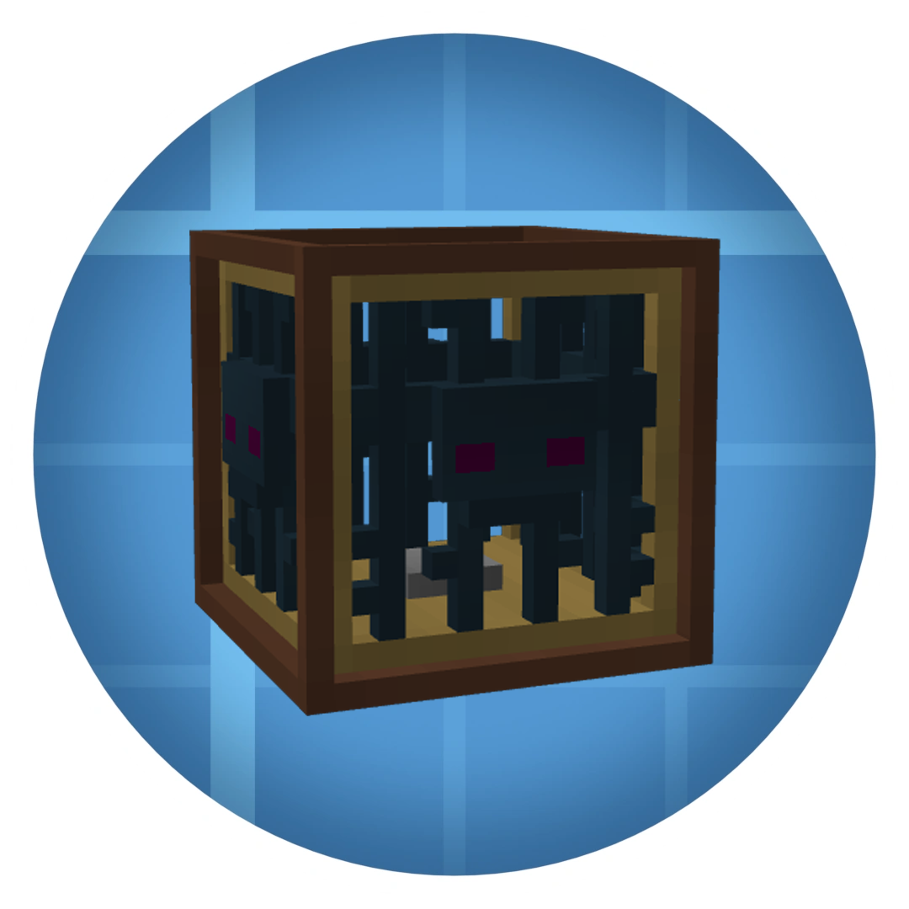

  

  # Create: Mob Grinding
  
  
	
  

An addon for the **Create** mod that brings a kinetic way to spawn and grind mobs in Minecraft! Extract souls from Vanilla spawners and utilize rotational force to power your very own customizable mob farms.

---

## Features

- **Chunk Extraction**: Mine Vanilla Spawners with a Pickaxe to extract a **Mob Spawner Chunk** containing the soul of the mob inside.
- **Rotational Mob Spawner**: A kinetic machine that consumes Stress Units (SU) to spawn mobs. 
- **Rotational Mob Grinder**: A spinning blade to automatically eliminate mobs and gather their loot.
- **Dynamic Tiering System**: Mobs are automatically grouped into 5 Tiers. Higher tier mobs require much more SU and time to spawn compared to lower-tier ones!
- **Highly Configurable**: Define base spawn progress, base grinder damage, and even blacklist destructive mobs (like the Warden or Ender Dragon) in the NeoForge config.

---
## Issues and Bug Reports

Found a bug or have a suggestion? We'd love to hear it! 
Please open an issue in the **[Issues Tab](../../issues)**. 

**Important:** Please ensure you select and fill out the provided Issue Template. Bug reports that don't follow the template may take much longer to resolve.

---

## Supported Languages
🇮🇹 🇺🇸 

If you want to help with translations you can find the files in: `src/main/resources/assets/createmobgrinding/lang/`, copy the base `en_us.json` file and rename it to your language code (e.g., `es_es.json` for Spanish, `fr_fr.json` for French).
